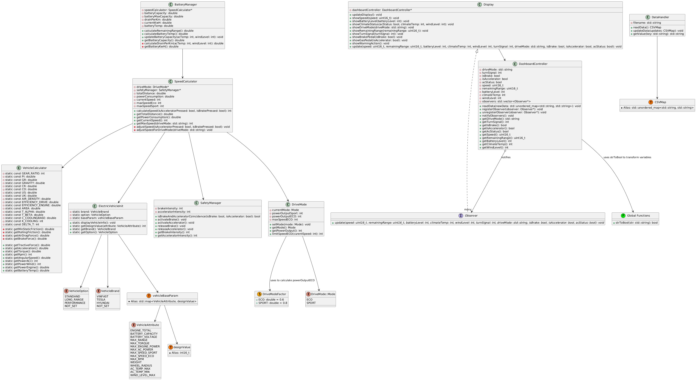

# car_dashboard_prj

## Overview

**Car Management** is a C++ project that simulates a vehicle dashboard system. It is designed with modular components to manage and display various aspects of a car's status, such as speed, battery, drive mode, safety features, and more. The project uses modern C++ techniques and design patterns to ensure maintainability, scalability, and thread safety.

## Features

- Modular architecture with separate classes
- Observer pattern for efficient UI updates
- Multithreading for concurrent data processing and UI rendering
- Mutex locking to ensure thread safety when accessing shared resources
- Reads vehicle data from CSV files
- Uses the `ncurses` library for terminal-based dashboard display

## Techniques Used

- **Observer Pattern:**  
  This project uses the Observer pattern to update the display and related components when vehicle data changes.

- **Singleton Pattern:**  
  Singletons like VehicleConfig and DataHandler centralize configuration and sensor data access for consistent use across the dashboard.

- **Multithreading**
  The project uses C++ std::thread to separate three concurrent processes: sensor acquisition, vehicle data processing, and UI rendering.
  
- **Mutex Locking**
  Shared resources are protected using mutexes (`std::mutex` and `std::lock_guard`) to prevent race conditions and ensure data consistency between threads.

## UML Diagram

The following UML diagram illustrates class relationships of the project:



## Directory Structure

  ```
  .
  ├── CMakeLists.txt
  ├── include/
  │   ├── BatteryManager.h
  │   ├── DashboardController.h
  │   ├── DataHandler.h
  │   ├── Display.h
  │   ├── DriveMode.h
  │   ├── SafetyManager.h
  │   ├── SpeedCalculator.h
  │   └── VehicleConfig.h
  ├── src/
  │   ├── BatteryManager.cpp
  │   ├── DashboardController.cpp
  │   ├── DataHandle.cpp
  │   ├── Display.cpp
  │   ├── DriveMode.cpp
  │   ├── SafetyManager.cpp
  │   ├── SpeedCalculator.cpp
  │   ├── VehicleConfig.cpp
  │   └── main.cpp
  ├── data/
  │   └── Database.csv
  └── build/
  ```

## Build Instructions

1. **Install Dependencies**
   - Make sure you have CMake, a C++ compiler, and the `ncurses` library installed.
   - On Ubuntu:  
   ```sh
   sudo apt-get install build-essential cmake libncurses5-dev
   ```

2. **Build the Project**
   ```sh
   mkdir -p build
   cd build
   cmake ..
   make
   ```

3. **Run the Dashboard**
   ```sh
   ./Dashboard
   ```

## Usage

- The dashboard reads data from `data/Database.csv` and displays real-time vehicle information in the terminal.
- You can modify the CSV file or extend the code to simulate different scenarios.
